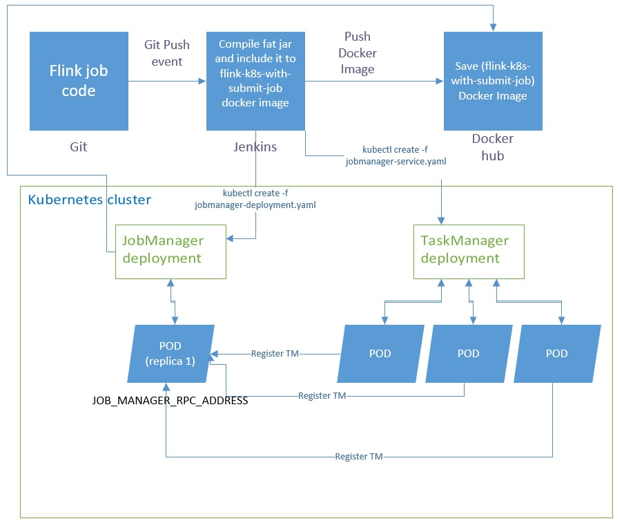

# Flink on Kubernetes.

**Flink achitecture**

<ul>
  <li>One active JobManager(JM) </li>
  <li>Several TaskManagers(TM)</li>
</ul>

**One job per cluster**
<ul>
  <li>Evolving job deployment philosophy</li>
  <li>Tie cluster lifecycle to job lifecycle)</li>
  <li>Ideally, the job is first-class. 
  (think about running a job on a platform like Kubernetes, 
  not a running Flink cluster first then submitting the job)</li> 
</ul>

**Flink-on-K8s**

<ul>
  <li>JobManager Deployment(jobmanager-deployment.yaml)
  <ul>
    <li>maintain 1 replica of Flink container running as a JM </li>
    <li>apply a label like "flink-jobmanager"</li>
    <li>Jobmanager uses custom Flink Docker image "afilichkin/flink-k8s-with-submit-job" , it start JM and also submit the "app.jar"
  </ul>
  </li>
  <li>JM service(jobmanager-service.yaml)
  <ul>
      <li>make JobManager accessiable by a hostname & port</li>
      <li>select pods with labebl "flink-jobmanager"</li>
    </ul>
    </li>
    
  <li>TaskManager Deployment(taskmanager-deployment.yaml)
    <ul>
      <li>maintain n replica of Flink container running as a TM </li>
    </ul>
  </li>    
</ul>

**custom Flink Docker image "afilichkin/flink-k8s-with-submit-job" has only one change in "docker-entrypoint-custom.sh":**

    
    #Customization start
    #fix for https://issues.apache.org/jira/browse/FLINK-9937
    echo " 127.0.0.1 ${JOB_MANAGER_RPC_ADDRESS}" >> /etc/hosts
   
    echo "Submit flink job in background"
    exec   /submit-flink-job.sh &
    #Customization end

# Main flow

# flink-k8s: Flink image that can work with Kubernetes.
Flink image for Kubernetes that fixes Jobmanage connection issue
https://issues.apache.org/jira/browse/FLINK-9937

You can use afilichkin/flink-k8s in jobmanager-deployment.yaml file

docker-entrypoint-custom.sh has only one change:
echo " 127.0.0.1 ${JOB_MANAGER_RPC_ADDRESS}" >> /etc/hosts
